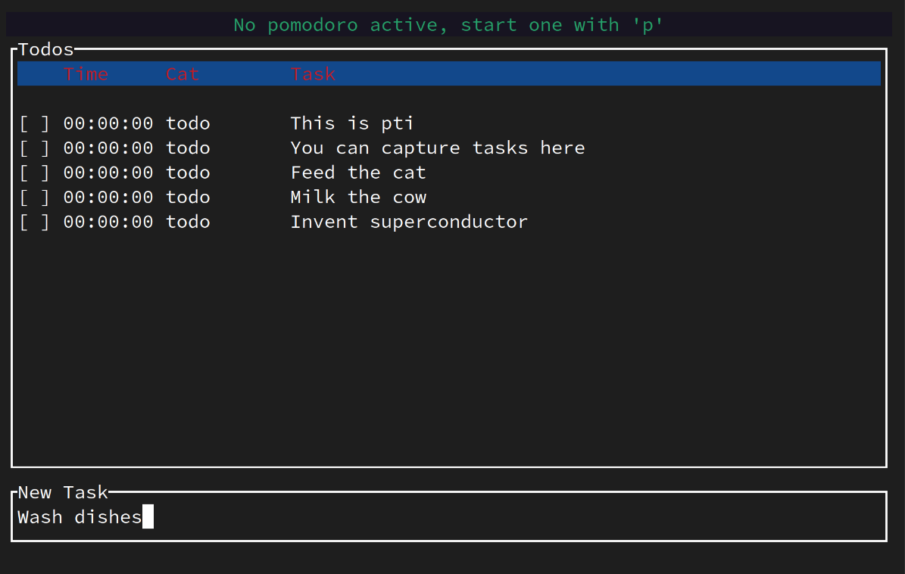
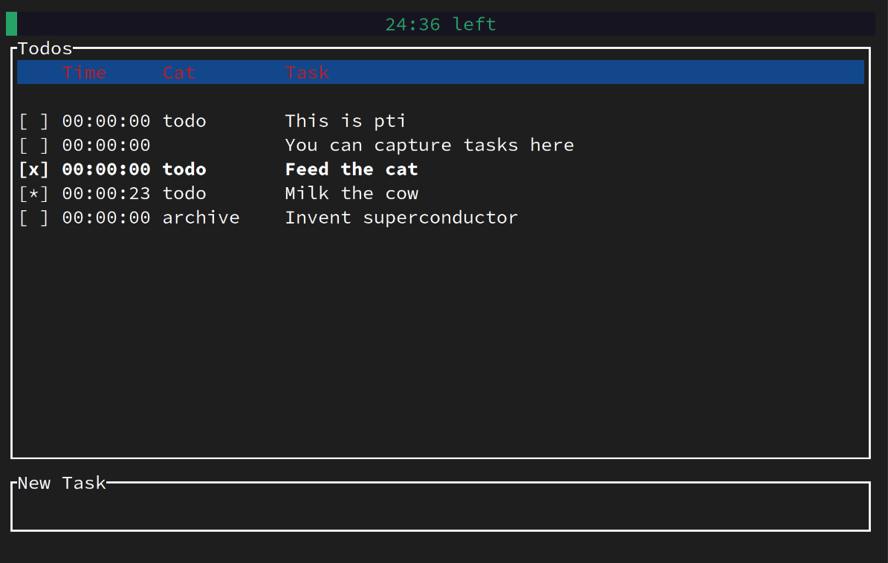
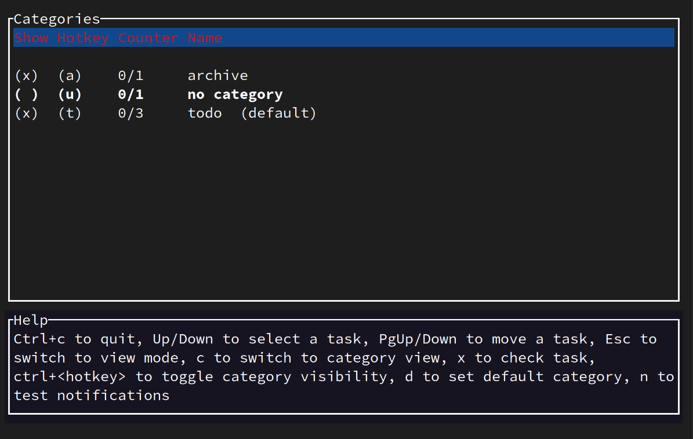

# PTI - Pomodoro Timer Interactive

This is a no-bullshit, terminal-native keyboard-only pomodoro timer built on [ratatui](https://github.com/ratatui-org/ratatui) that suits the way I like to track my tasks and time. Which is, that in the morning I create a list of tasks for the project I want to work on, during the day I tick them off through pomodoros and in the evening I move all tasks to the archive, contemplating on how much time I have wasted on which task. I don't like to use the mouse, and I don't like to use the browser. I like to use the terminal, and also I like when applications react faster than my eye can perceive.

# Features

- Tracking tasks in different categories
- Hide categories, based on the scope you're working on
- Timing pomodoros, with optional notifications at the end

Capture tasks with an intuitive editor:



Start a pomodoro, and accumulate time on your tasks:



See categories, toggle visibility:



# Installation

You can install pti with or without notifications enabled. If enabled, it will use [rodio](https://github.com/RustAudio/rodio) to play a sound and [notify-rust](https://github.com/hoodie/notify-rust) to display a desktop notification. 

```bash
# Without notifications enabled
cargo install --git https://github.com/blacksph3re/pti.git
# With notifications enabled
cargo install --git https://github.com/blacksph3re/pti.git --features=notifications
```
PTI reads its state from a json file called database.json, which by default lives in the `~/pti` directory. Alongside the database lives an alarm.mp3 which holds the sound to be played upon completion of a pomodoro. You can change the location of the database and alarm file by setting the `PTI_STORAGE_DIR` environment variable. Before first running pti, you need to create the directory and copy the alarm file there.

```bash
mkdir ~/pti
wget https://raw.githubusercontent.com/blacksph3re/pti/main/alarm.mp3 -O ~/pti/alarm.mp3
```

Make sure you have `~/.cargo/bin` in your `$PATH` if you want to start pti from anywhere, otherwise, move to `~/.cargo/bin` and run `./pti`.


# Usage

Global hotkeys:
- Ctrl + q/Ctrl + c: Quit
- Ctrl + \<category hotkey\>: Toggles the visibility of the category with this hotkey


Hotkeys in TODO view list:
- Up/Down: Move cursor (also, when typing, jump back to todo-list view)
- PageUp/PageDown: Move task up or down
- x/Space: Check a task
- p: Toggle whether the task is part of the active pomodoro, start one if not running
- Enter/Esc: Start typing a task
- c: Category view
- \<category hotkey\>: Assigns the category to this task
- n: Test notifications

Hotkeys in TODO edit mode:
- Enter: Save task
- Up/Down: Jump to todo-list view

Hotkeys in CATEGORY view list:
- Up/Down: Move cursor
- x/Space: Toggle visibility of the category
- d: Make category default

# Caveats

Currently, editing categories needs to happen directly in the json file. Make sure to close pti before editing it, otherwise it will overwrite your edits the next time you do something in the app. I don't plan on implementing this right now, but I'm open to accept PRs.

Furthermore, you're responsible for keeping backups. Especially if you'd keep the task data around a bit longer. 
